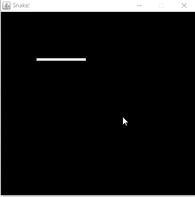

# Evento Profissão Dev Java

Descrição: Projeto desenvolvido durante o evento "Profissional Dev Java" da Softblue ([https://www.softblue.com.br](https://www.softblue.com.br)).

## 💻 Projeto Desenvolvido

Jogo Snake - Consiste em um jogo onde o player (cobra) deve comer as comidas que aparecem na tela. Cada comida deve contabilidar um ponto exibindo o total quando o jogador perder o jogo (a cobra bater em uma das extremidades ou nela mesma).

## :camera: Demonstração

## :rocket: Conceitos e tecnologias

✔️ Java e Orientação a Objetos

✔️ Bibliotecas JFrame e Graphics

## :phone: Contato

 Linkedin [https://www.linkedin.com/in/danyllo-valente-da-silva-3569b460](https://www.linkedin.com/in/danyllo-valente-da-silva-3569b460)

:postbox: E-mail [danyllo.dvs@gmail.com](danyllo.dvs@gmail.com)
